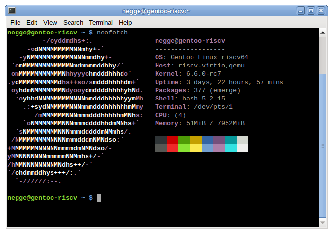

# RISC-V Developer Environment

This archive includes a 6.5-rc3 kernel and Gentoo Linux userspace configured for
RISC-V to enable development and testing of RVV optimizations to OSS projects.



## Getting Started

This setup has been tested with qemu-8.0.3. To boot the VM simply run:

```
$ ./start.sh
```

There are two accounts available on the system, root and negge. Both have the
same password: rise

At boot, the VM starts sshd on port 22. The start.sh script includes a setting
to map host port 10000 to VM port 22. You can ssh in with the user account:

```
$ ssh -p 10000 negge@localhost
```

## Installed Software

This machine has the latest developer tools installed. The following packages
are built for RISC-V and available to use:

| Package                | Release Date |
| ---------------------- | ------------ |
| bison-3.8.2            | 2021-9-21    |
| clang-16.0.6           | 2023-6-14    |
| cmake-3.27.1           | 2023-7-25    |
| flex-2.6.4             | 2022-9-24    |
| gcc-13.2.0             | 2023-7-27    |
| git-2.41.0             | 2023-6-1     |
| make-4.4.1             | 2023-2-26    |
| ninja-1.11.1           | 2022-8-30    |
| openssl-3.1.1          | 2023-5-30    |
| python-3.12.0_beta4_p1 | 2023-7-11    |
| rust-1.71.0            | 2023-7-12    |

## Testing RISC-V Extensions

There are two programs in the negge user directory:

```
$ ls test
hwcap  hwcap.c  testrvv  testrvv.as  testrvv.o
```

1. The `hwcap` program tests that the 'V' bit is set by getauxval(AT_HWCAP)
2. The `testrvv` program executes the vsetvli instruction and returns

These can be used to confirm that the 6.5-rc3 kernel is properly built with
CONFIG_RISCV_ISA_V=y and CONFIG_RISCV_ISA_V_DEFAULT_ENABLE=y.

## Advanced Use

It is possible to use `qemu-binfmt` to mount and run the system in a chroot. This
has the advantage of using the host kernel and MMU and is significantly faster.
If you have not set up `binfmt_misc` before, see the section [Setting up
binfmt_misc](#setting-up-binfmt_misc).

As root, configure and start the `qemu-binfmt` service. You can confirm this is
done correctly with:

```
$ cat /proc/sys/fs/binfmt_misc/qemu-riscv64
enabled
interpreter /usr/bin/qemu-riscv64
...
```

The VM already contains a staticly compiled x86_64 QEMU user binary with the
patch from [1] backported to qemu-8.0.3 at:

```
/usr/bin/qemu-riscv64
```

To create the chroot, run the following commands as root:

```
mount -o loop,offset=1048576 gentoo.img /mnt/gentoo
cp /etc/resolv.conf /mnt/gentoo/etc
mount --bind /proc /mnt/gentoo/proc
mount --bind /sys /mnt/gentoo/sys
mount --bind /dev /mnt/gentoo/dev
mount --bind /dev/pts /mnt/gentoo/dev/pts
mount --bind /dev/shm /mnt/gentoo/dev/shm
```

You can enter the chroot with:

```
chroot /mnt/gentoo /bin/bash
env-update && source /etc/profile
```

Using the chroot is recommend for building and installing new packages into the
VM with the emerge command.

**Note, there are some differences between a qemu-user chroot and qemu-system**

1. The host kernel is still `x86_64` so `/proc/cpuinfo` will not show the RISC-V ISA
extensions
2. Process concurrency is handled by the host kernel

For this reason it is recommended to develop and test RVV optimizations in
the emulated VM.

[1] https://gitlab.com/qemu-project/qemu/-/issues/1793

### Setting up binfmt_misc
The way in which `binfmt_misc` is set up depends on the system that is used, but
requires root access in all cases.

At the end of this, the `binfmt_misc` entry for `qemu-riscv64` will point to the
path that is expected in the chroot. The entry will also point to a standard
installation path for the QEMU binaries.

#### Ubuntu
It is assumed that the QEMU interpreter required is the one installed from the
package manager.
```
sudo apt install qemu-user-static
```
The path to the interpreter stored in `binfmt_misc` then points to a symlink,
where we want to point to the actual interpreter.
```
sudo apt install binfmt-support
sudo sed -i 's|interpreter .*|interpreter /usr/bin/qemu-riscv64-static|' /usr/share/binfmts/qemu-riscv64
sudo update-binfmts --importdir /usr/share/binfmts --import qemu-riscv64
cat /proc/sys/fs/binfmt_misc/qemu-riscv64
# enabled
# interpreter /usr/bin/qemu-riscv64-static
# ...
```
You should now be able to follow the remaining instructions from the previous section to launch the chroot.